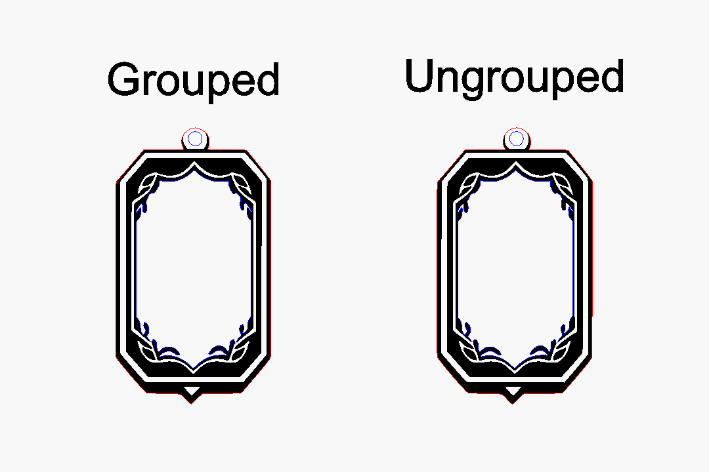
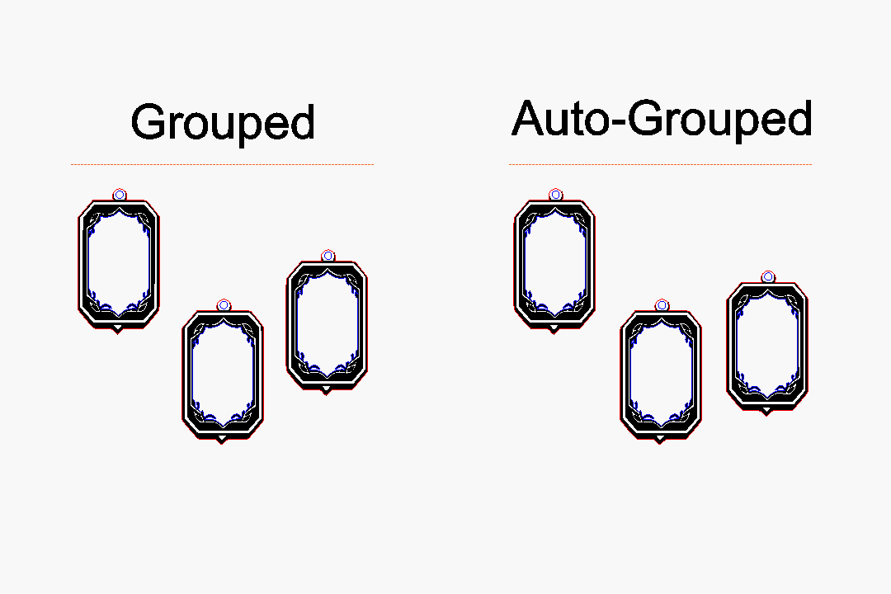

<!--  -->

[Groups](#) are used to speed up the process of selecting, moving, aligning, and arranging designs; particularily when those designs are made up of multiple parts (lines, shapes, images, text, etc.). 

If you can't node-edit an [imported](#) design, it could be because that design needs to be [ungrouped](#). 

<!--  -->

In addition to standard grouping tools, LightBurn can also [auto-group](#) multiple multi-part objects with their respective components, which is very handy for files that contain multiple designs. 

## Group
**Insert group card here**
*Groups* collect independant objects ([lines](#), [shapes](#), [images](#), [text](#), etc.) together so that they can be edited ([moved](#), [scaled](#), [rotated](#), [docked](#), [aligned](#), [distrubuted](#) etc.), while maintaining their relative positions and sizes. Groups can be comprised of objects of different [layers](#). Grouping objects also makes related objects easier to select; for example you might be making a many earrings each with an image engraved and a hole. You could group each earring's parts together to make them easier to select so that you can lay them out on your workplane. 

Grouping is sometimes confused with the [Boolean Modifier tools](#), the difference being that Boolean Modifiers change the underlying node-structure of the objects, whereas groups do not. Grouped shapes are not "connected" - if you draw four distinct lines, and make their ends touch so it looks like a square and then group them, they are still four distinct lines, not a continuous connected path. To join the shapes together, you would use the [Auto Join](#) tool.

You can make groups within groups by grouping some objects, selecting some more objects and grouping them again. When you ungroup the object it will undo one 'level' of the grouping, preserving the groups within it. This can be really handy when you want to align the centre of two objects with the centre of another object. 

## Ungroup
**Insert ungroup card here**
*Ungrouping* simply turns a set of grouped objects back into individual ones. Nodes cannot be edited directly in grouped objects, so to change the nodes in a grouped object you must first ungroup it. Some designs made in other software may import as a group, and thus require ungrouping before they can be edited. 

## Auto-Group
**Insert autogroup card here**
Automatically groups shapes with   in other shapes that contain them, for example if you had a 10 donut-shaped vectors, and you selected them all and auto-grouped them, you would end up with 10 groups, each containing the outer line of the donut and the 'hole' of the donut. 

## Troubleshooting
If you are still not able to use the node edit tool on an object you have ungrouped, the object may need to be [converted to a path](#), [traced](#), or it may be a [live array](#). 

Some tools treat object as groups when you use them on more than one object at a time (e.g. [offset shapes](#), [kerf offset](#)) in order to provide the most intuitive result.

Technically when you make a group LightBurn is creating a 'container' and putting the objects within it. When you ungroup them, it removed the objects from the container and deletes them.   

## Related
Groups are sometimes confused with boolean operators. 