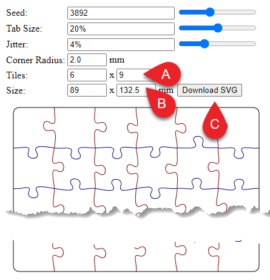
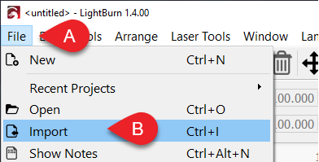
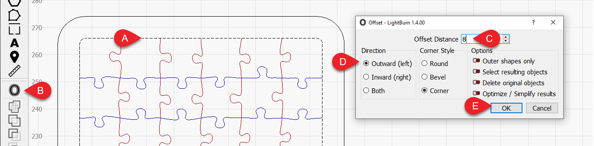
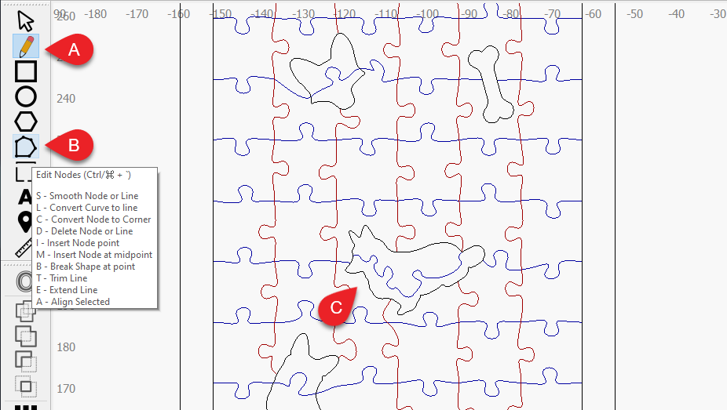

<!--

{# 
TO DO/ Suggestions:
    ❏ Finish instructions 
    ❏ Work out title 
    ❏ Make image engrave guide 
    ❏ Make ai image generation guide
    ❏ Get photos
    ❏ Finalize text
 #} 
-->
 
 

 Birthdays, holidays, illnesses, and engagements; no matter the occasion, people love seeing their pets! And most of us don’t mind a little puzzle either… 

This quick and personalized gift is the perfect project for a beginner. Design it, cut it and send it to your loved one to piece together until they realize it’s a picture of their very own furry-friend.  😊\

## In this tutorial you will learn:
* How to use a free puzzle generator and import it into LightBurn. 
* How to add a border to your puzzle (Offset tool)
* How to create fancy custom-shaped pieces (Draw and Node Edit tools)
* How to add your photo
* How to set up your job in the optimal workflow (Layer/Cut Settings) 

And we will also give you a bunch of tips for how you can take what you’ve learned and further customize it to suit your own goals!

##  You will need: 

* Your chosen **material**. Roughly 1 - 2mm ( ≈ ⅛ - ¼ in) thick + corresponding cut and engrave settings: laser plywood is nice!
    * If you don’t know your settings for this material yet, you can read more about the [image engrave](https://docs.lightburnsoftware.com/UI/CutSettings/CutSettings-Image.html) and [line (cut)](https://docs.lightburnsoftware.com/UI/CutSettings/CutSettings-Line.html) settings in our [Cut Settings Documentation](https://docs.lightburnsoftware.com/UI/CutSettings/index.html). You might also like to use LightBurn’s [Materials Test Generator](https://docs.lightburnsoftware.com/Tools/MaterialTest.html) to automate the settings-finding process. 
* **An image** you wish to engrave. 
    * You can raid the social media of the pet-parent; 
    * Or even generate one using an AI, like [Midjourney]([https://www.midjourney.com/](https://www.midjourney.com/)) as I have done here.
* **Dimensions** of your card. If you are sending it in the mail, this will be a bit smaller than your chosen envelope. 
    * I’m making my finished size [ISO A6](https://en.wikipedia.org/wiki/Paper_size#A_series) in size, (105 x 148.5mm) which will fit into an [ISO C6](https://en.wikipedia.org/wiki/Paper_size#C_series)-style envelope. 
    * I’m going to create a border for my puzzle of 8mm so the puzzle within will be 89 x 132.5mm 

##  Creating your Design: 
Note: you can skip these steps and download the template here. 

1. Use the free online [Jigsaw Puzzle Generator](https://github.com/Draradech/jigsaw) by [Manual Kasten (Draradech)](https://github.com/Draradech/jigsaw) to **create the puzzle pieces;**

<!--
Subtitle/annotations & Alt test

Title:
Settings used in this example for the rectangular puzzle generator at https://draradech.github.io/jigsaw/jigsaw.html.

Body:
Settings are as follows;
Seed: 3892,
Tab Size: 20%,
Jitter: 4%,
Corner Radius: 2mm,
Tiles: 6x9,
Size: 89x132.5mm
-->    

2. **Import the jigsaw** into LightBurn; 

<!--

 \
Open LightBurn and click File>Import (or Ctrl+I/⌘+I on your keyboard), navigate to your jigsaw file, and click *Open*. \
--> 

3. **Create a border** using the offset tool;

<!--
![alt_text]
-->  
3. 
    1. Click the black outline around the puzzle to select it.
    2. Then click on the [Offset Tool](https://docs.lightburnsoftware.com/Tools/ModifierTools.html#offset) from the toolbar on the left
    3. Change the *Offset Distance* to the thickness of your border (in my case, 8mm). 
    4. Ensure the Direction of the offset is set to *Outward*. 
    5. Click *OK*. 

4. Add **fancy shaped-pieces;**

<!--
!alt_text)
-->
4. 
   1. You can create new shapes using the [Draw Lines](https://docs.lightburnsoftware.com/UI/CreationTools.html#draw-lines-tool) tool, or find an existing vector online from somewhere like [The Noun Project](https://thenounproject.com/) and import it. Else you might also want to get LightBurn to [trace](https://docs.lightburnsoftware.com/Tools/TracingImages.html) a pixel-based image for you.
   2. You can edit both the new shapes and the puzzle using the [Edit Nodes](https://docs.lightburnsoftware.com/UI/CreationTools.html#draw-lines-tool) tool. Tip: you can hover over the node edit tool icon to see a list of hotkeys!
   3. As you customize the pieces, remember your shapes still need to be able to lock together, so add nubbins, and be sure not to make any parts too small, or they may end up too delicate!

5. **Add the pet photo;**
    1.  Import the image using File>Import (or Ctrl+I/⌘+I on your keyboard), navigate to your pet photo file, and click *Open*. 
    2.  Move and scale it using the [Selection Tool](https://docs.lightburnsoftware.com/UI/ZoomPanSelect.html#selection) (Esc).
    3.  Trim off the excess using the [Image Masking](https://docs.lightburnsoftware.com/ImageMasking.html) tool and the outermost border. Remember you can toggle the image to [not show](https://docs.lightburnsoftware.com/UI/CutsAndLayers.html) in the cuts/layers menu, if you’re having a hard time selecting the border line. 
6. **Set up the cut;**
    1.  Order of ops 
    2.  Cut settings 
    3.  Placement 
    4.  Run job
7. **Send it to the one you love!**

    

If you ever get stuck, please [reach out to us](https://lightburnsoftware.com/pages/contact-help-suggestions), we’re here to help! 

This workflow is only one way to make puzzle, you can customize this project to suit your own goals!

* Perhaps your loved one doesn’t have a pet, but you could instead make it a picture of their kids, their marriage photos, a great holiday, a new house, a favorite movie poster, anything they love! 
* Or you might like to use a printed color photo, in which case, our [Print and Cut](https://docs.lightburnsoftware.com/PrintAndCut.html) tool will come in handy when you go to align your puzzle to the image in real life. 
* You could add a name, date or title to the puzzle, our [Text](https://docs.lightburnsoftware.com/UI/FontsAndText.html) tool is great for that! You’d then set that text layer to [Fill Mode](https://docs.lightburnsoftware.com/UI/CutSettings/CutSettings-Fill.html), to color it in.  
* You don’t have to make a little card, you can make it a full-sized puzzle by changing the size and number of pieces (tiles) in the puzzle generator. 

No matter what you do, we hope you enjoy making it! 

